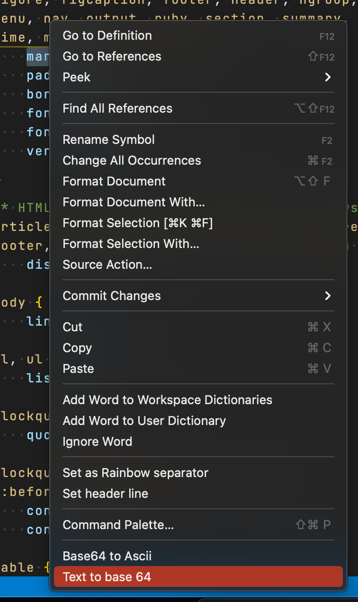
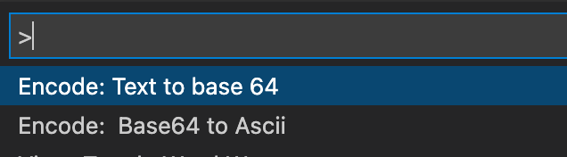

### If is possible
I'm reachable at ethics_patrol0x@icloud.com
I hear suggestions for the extension, guess I'll deliver quickly new features, thanks =)
[Would like to support me?](https://paypal.me/AreuAbellan?country.x=CO&locale.x=en_US)
# Image to Base 64 Clipboard

Supported files  ".png", ".jpg", ".jpeg", ".gif", ".webp", ".ico"

## Features
* NEW Preview image from selected Base64 with his data:image/png;base64,... prepend to the string
 - `data:image/png;base64,` is a must
* Encode image files to Base64
* Encode selected text to Base64  accept __Multiple Selection__
* Decode selected base64 to Ascii accept __Multiple Selection__

#### Select the file, into the contextual menu 'Encode: to base 64' that's all

#### Select the file, into the contextual menu 'Encode: to base 64' that's all

#### Context editor window

#### Command palette

## Known Issues

By the moment nope

## Fell free to make any request
I'm reachable at `ethics_patrol0x@icloud.com`

