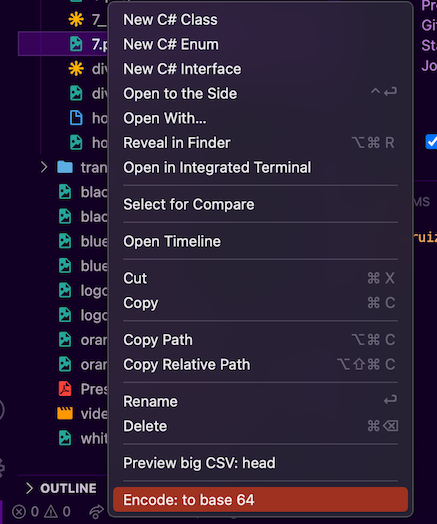

# Image to Base 64 Clipboard README

Supported files  ".png", ".jpg", ".jpeg", ".gif", ".webp", ".ico"

## Features

Select the file, into the contextual menu 'Encode: to base 64' that's all

## Known Issues

By the moment nope
### 0.0.1

Initial release
